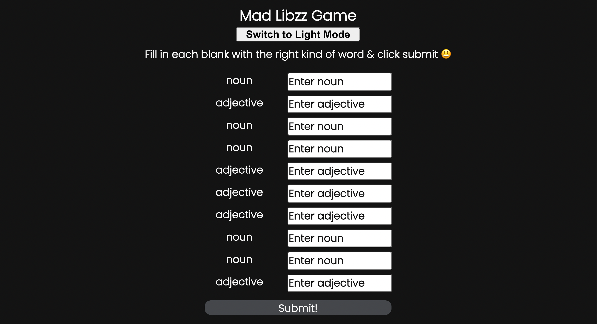
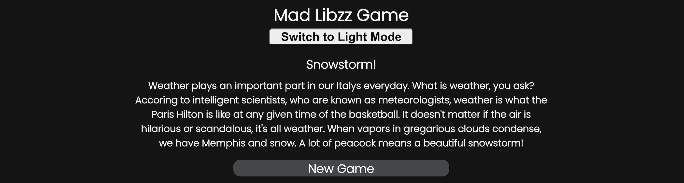

# Mad Libzz - word game

Fill in the blanks with random words and enjoy the story you create!

[Play Mad Libzz](https://madlibzz.netlify.app/) 😮

## Table of Contents
* [Screenshots](#screenshots)
* [Setup](#setup)
* [Technologies](#technologies)
* [Attributions](#attributions)

<p align="center">
    
</p>

### Screenshots

Example of the intial screen you get on Mad Libzz. All but the last three blanks were filled out for illustrative purposes 🙂

<p align="center">
    
</p>

This is a screenshot of a finished story. After you fill in all the blanks you get to read and enjoy how it all meshes together. You can also start a new game.

<p align="center">
    
</p>

### Setup

Node.js and NPM are required to run this project. If you don't have them installed please follow [these instructions](https://docs.npmjs.com/downloading-and-installing-node-js-and-npm) first.

1. Click the green code button:


2. From there, click the button to the right of the URL under HTTPS. This will copy the URL of the repository.

3. Then open your terminal or command line. If you haven't used the command line before [learn how to here](https://www.theodinproject.com/lessons/foundations-command-line-basics).

4. If you've got a folder where you keep projects, change directories into that folder. After that type this command:

```git clone https://github.com/AlexVCS/mad-libzz.git```

This clones the repository to your local machine. It has a root directory called `mad-libzz` to store all the files.

5. Change directories into that folder:

```cd mad-libzz```

After that you can open the project in your text editor of choice. I use Visual Studio Code and launch it from the command line. [Learn how here](https://code.visualstudio.com/docs/setup/mac).

6. Once you have the project open, you need to install the dependencies. Run this in your command line from the root (mad-libzz folder) of the project:

```npm install```

7. After that finishes, run this to start the project:

```npm start```

### Technologies

* React
* CSS
* JavaScript

### Attributions

*Photo at the top is from [Fred Seibert on Flickr](https://flickr.com/photos/84568447@N00/), with a small edit*

*[Madlibs API](https://madlibz.herokuapp.com/api) is used to fetch the random story and blanks*
